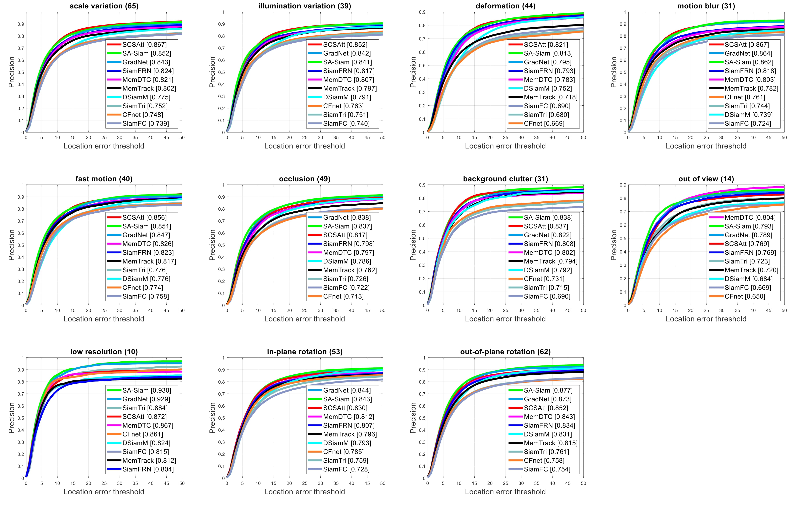
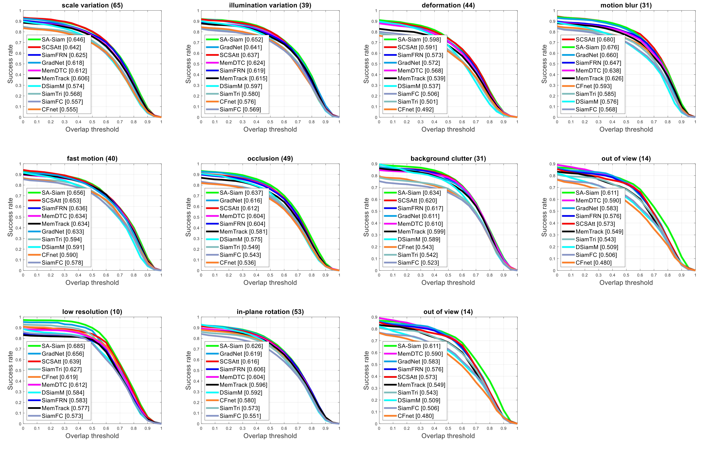
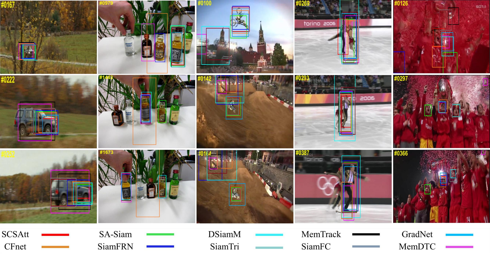

# VOT_Book-Chapter

# Book title: Visual Object Tracking (ISBN 978-1-83969-461-5)

## Chapter title: Siamese-based Attention Learning Networks for Robust Visual Object Tracking

### Authors: Md. Maklachur Rahman and Soon Ki Jung

#### Section 4. Experimental analysis and results

##### Figure 11. Compared trackers’ performance on the challenging attributes of OTB100 benchmark in terms of precision plots.

##### Figure 12. Compared trackers’ performance on the challenging attributes of OTB100 benchmark in terms of success plots.

#### Figure 13. The qualitative comparison results among trackers over several challenging sequences (carScale, liquor,motorRolling, skating2-2, and soccer) from OTB100 benchmark.

